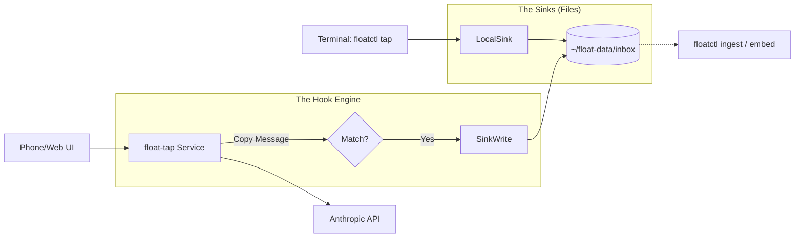

# FLOAT-TAP: The Boring Capture System

**Status:** Draft Specification
**Date:** 2025-11-19
**Context:** Project Float / Sysops

## 1. The Problem

Context switching kills flow.

  - **The Friction:** To capture a structured thought (e.g., "update the auth logic"), you currently have to leave the terminal, open a browser/app, wait for a load, and type.
  - **The Overkill:** Most "Agent" solutions try to be too smart, requiring complex orchestration just to append a line to a file.
  - **The Goal:** A mechanical, low-latency "tap" on your existing workflows (Terminal & Chat) that captures messy inputs and dispatches them to structured sinks without you leaving your environment.

## 2. Core Philosophy: "The Chat is the Buffer"

We do not build an agent that "decides" to save things. We build a mechanical system that observes streams and extracts signals based on rigid rules.

  * **Latency:** Zero (async processing).
  * **Intelligence:** None (RegEx) or Minimal (Tiny LLM for formatting).
  * **Output:** Files on disk (`.jsonl`, `.md`) that `floatctl` already knows how to ingest.

## 3. Architecture

The system has two entry points but one unified backend "sink" strategy.



## 4. The Terminal Integration (`floatctl`)

These commands allow you to capture thoughts without leaving your shell.

### A. The One-Shot Tap (`floatctl tap`)

*For instant, fire-and-forget dumping of thoughts.*

```bash
$ floatctl tap "scampers:: check the pgvector migration logic"
> [✓] Captured to ~/float-data/inbox/scampers.jsonl
```

  * **Behavior:** Appends raw text to a JSONL file.
  * **Latency:** Instant (no network).

### B. The Active Dispatch REPL (`floatctl dispatch`)

*For unloading a session's worth of context into structured actions.*

```bash
$ floatctl dispatch
float(sysops)> just finished the auth refactor.
float(sysops)> messy notes:
float(sysops)> - token expiry is hardcoded
float(sysops)> - need to update .env.example
float(sysops)> ::send

[thinking...]
> [✓] Appended to sysops/2025-11.md
> [✓] Added todo to .env.example
```

  * **Behavior:** Buffers lines until `::send`. Sends buffer + "Format this" instruction to a fast, cheap LLM (Haiku). Writes result to file.

### C. The Modal Note (`floatctl note`)

*For when a single line isn't enough.*

  * **Behavior:** Opens a TUI (using `ratatui`) with a large text area.
  * **Action:** On save (`Ctrl-S`), writes to `scratchpad.md` or daily note and exits immediately.

## 5. The Proxy Service (`float-tap`)

*Optional: For when you are on your phone/web.*

A simple Node.js or Rust server that sits between your chat UI and the LLM API.

### Configuration (`hooks.yaml`)

This is the only file needed to define behavior.

```yaml
hooks:
  # TYPE A: PASSIVE WIRETAP (Zero Tokens)
  - id: "scampers-capture"
    match:
      direction: "user"
      starts_with: "scampers::"
    capture:
      window_before: 0
    sink:
      type: "file"
      path: "~/float-data/inbox/scampers.jsonl"

  # TYPE B: ACTIVE DISPATCH (Minimal Tokens)
  - id: "sysops-log"
    match:
      direction: "user"
      ends_with: "::send"
    transform:
      model: "claude-3-haiku"
      system: "Format input into a single markdown bullet with timestamp."
    sink:
      type: "file"
      path: "~/float-hub/sysops/current.md"
```

## 6. Implementation Roadmap

### Phase 1: The "Shack" (Terminal Only)

1.  **Add `tap` command to `floatctl`:**
      * Takes a string argument or stdin.
      * Appends to `~/.float-data/inbox/tap.jsonl`.
2.  **Add `dispatch` command skeleton:**
      * Use `rustyline` for the REPL loop.
      * Implement the `::send` trigger.
      * Hardcode one "Sysops" prompt transformation using your existing `floatctl-core` client.

### Phase 2: The Proxy (Phone Access)

1.  **Build `server.ts`:**
      * Simple Express/Fastify server.
      * Accepts `POST /chat`.
      * Implements the `hooks.yaml` logic (Regex matching).
2.  **Build `index.html`:**
      * Dumbest possible chat UI.
      * Connects to your proxy.

### Phase 3: The Feedback Loop

1.  **Update `floatctl` to watch sinks:**
      * Make `floatctl sync` aware of the inbox folder.
      * Process `tap.jsonl` entries into your main knowledge base.

## 7. Why This Wins

1.  **`Ctrl-Z` Friendly:** It lives in your terminal process.
2.  **Pipe Friendly:** `cat logs.txt | floatctl tap` works.
3.  **Local First:** Capture happens instantly; intelligence happens async.
4.  **Boring:** No agents, no vectors (yet), just files and regex.